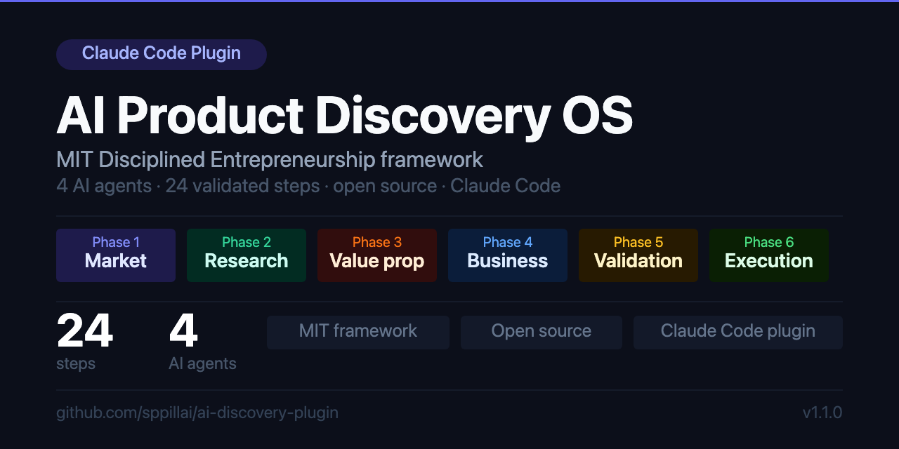

# AI Product Discovery OS

   

---

## The problem

Solo founders waste 3–6 months building products nobody wants. Not because they're bad at building — because they skip the hard questions. Who exactly is your customer? What does their life look like today? Would they actually pay for this? Most founders jump straight to building and find out the answer too late.

Existing AI tools make building faster. None of them make you validate first.

## What this is

A Claude Code plugin that enforces rigorous product validation before you write a single line of code. You describe your idea, four AI agents run the full **MIT Disciplined Entrepreneurship 24-step framework** — generating market research, customer personas, pricing models, financial projections, and an investor deck — and at every step you either approve the output or go do the real-world work (customer interviews, pricing conversations, PMF surveys) that only you can do.

At the end you have a complete discovery report, validated assumptions, a defined MVP, and a launch plan. Built before you build anything.

## Quick start

```bash
# 1. Install the plugin
claude plugin marketplace add sppillai/ai-discovery-plugin
claude plugin install ai-product-discovery

# 2. Install required skill packs
claude plugin marketplace add phuryn/pm-skills
claude plugin marketplace add nextlevelbuilder/ui-ux-pro-max-skill

# 3. Create a project folder and start
mkdir my-product-idea && cd my-product-idea
claude  # open Claude Code in this folder
# then run: /start-discovery
```

---

## Where to use it

Requires **Claude Code** — works in all Claude Code surfaces:

| Surface | How to access | Notes |
|---------|--------------|-------|
| **Claude Code CLI** | `claude` in your terminal | Recommended — best for long sessions |
| **Claude Desktop — Cowork** | Cowork tab in the Claude desktop app | Use "Work in a project" to point at your folder |
| **Claude Desktop — Code** | Code tab in the Claude desktop app | Same as the CLI, built into the app |
| **VS Code extension** | Install "Claude Code" from VS Code marketplace | Run `/start-discovery` in the Claude panel |
| **JetBrains extension** | Install from JetBrains Marketplace | Works in IntelliJ, WebStorm, PyCharm, etc. |

> **Not compatible with**: claude.ai web chat, OpenAI Codex, ChatGPT, GitHub Copilot, Cursor, or Windsurf. Plugins require the Claude Code CLI.

---

## How it works

1. Run `/start-discovery` and describe your product idea in 1–2 sentences
2. Four AI agents work through all 24 steps — generating research, spreadsheets, Word docs, and PowerPoint decks
3. After every step you get a checkpoint: approve the output, give feedback to revise, or paste in your real-world findings
4. At 10 steps, the AI tells you exactly what real-world action to take and waits for you to return with results
5. All deliverables are saved to your project folder as they're created

**Resuming**: open the project folder again in Claude Code — the plugin reads `project-state.json` and picks up exactly where you left off, including any pending human action.

### Steps that require your real-world input

At these 10 steps, the AI creates a findings template and waits for you:

| Step | What you do | Why it can't be skipped |
|------|-------------|------------------------|
| 3 — End User Profile | List 5–10 people you know who match the user profile | Seeds the real interview pipeline |
| 6 — User Validation | Conduct 5 customer discovery interviews | The most important step — real signal beats AI assumption |
| 11 — Pricing Strategy | Run 3–5 willingness-to-pay conversations | Grounds the LTV/CAC model in real data |
| 12 — Customer Acquisition | Map 10 potential early customers from your network | Validates go-to-market assumptions |
| 15 — Business Model | Share the canvas with 2–3 advisors | Tests revenue model before financial modeling |
| 19 — Key Assumptions | Review and rank the assumption matrix | Add what the AI missed from your direct experience |
| 20 — MVP Design | Pick one experiment and commit to a start date | The AI can't decide what you'll actually execute |
| 22 — PMF Confirmation | Run the Sean Ellis survey with 40+ users | The quantitative gate before building anything |
| 23 — Development Plan | Decide team structure and approve the tech stack | Gates the entire build timeline |
| 24 — Launch Prep | Execute the launch checklist | The AI drafts everything; you pull the trigger |

---

## The 24 steps

| Phase | Steps | What gets built |
|-------|-------|-----------------|
| **1 — Market Selection** | 1–2 | Target market segment, beachhead selection, TAM analysis |
| **2 — User Research** | 3–6 | End user profile, personas, lifecycle map, interview guide |
| **3 — Value Proposition** | 7–8 | Value prop, full PRD, feature prioritization matrix |
| **4 — Business Model** | 9–18 | Revenue streams, pricing, LTV/CAC, GTM channels, financial model, investor deck |
| **5 — Validation** | 19–22 | Assumption matrix, MVP design, MVP scope, PMF confirmation |
| **6 — Execution** | 23–24 | Development roadmap, tech architecture, launch plan |

## What we added to the framework

The MIT DE framework tells you **what** to validate in the right order. What it doesn't enforce is the connective tissue between user pain and the features you commit to building. Without that thread, value propositions become generic, feature lists are driven by gut feel, and no one can answer "why are we building this?" when the PRD is written.

This plugin adds a structured pain-to-feature chain across Steps 3, 5, 6, 7, and 8:

| Step | What's added | Why it matters |
|------|-------------|----------------|
| **3 — End User Profile** | Current state process map — a step-by-step map of what the user does TODAY, with pain severity (1–5) and emotional state at each step | Creates the "before picture" that everything downstream anchors to |
| **5 — Lifecycle Use Case** | Before & After transformation sheet added to the journey map Excel | Makes the value the product delivers concrete: each step of today's process mapped against what changes with the product |
| **6 — User Validation** | Interview findings loop back to update the process map — pain severity is re-scored based on real confirmation rate, new pains are added, every row marked as AI-assumed or interview-confirmed | Replaces AI assumptions with real evidence before the value prop is written |
| **7 — Value Proposition** | Opportunity map built from the top-severity pain points before the value prop is drafted — each pain becomes an opportunity with Impact × Confidence priority score | Value prop is written from the highest-ranked opportunity, not generic benefit language |
| **8 — Product Specification** | Every feature in the PRD links to a row in the opportunity map — features without a link are flagged "Needs validation" | Every feature can answer: which specific pain does this solve, how severe is it, and what process step does it change |

The result is a PRD where features are not invented — they are derived from real user pain, validated by interviews, and prioritised by opportunity impact.

---

## What you get

Every step produces real files in your project folder:

```
your-project/
├── project-state.json
├── IDEA.md
├── PHASE-1-MARKET-SELECTION/
│   ├── step-1-target-market-segment.md
│   ├── step-2-beachhead-market.md
│   └── deliverables/
│       ├── market-segmentation-matrix.xlsx
│       └── tam-analysis.xlsx
├── PHASE-2-USER-RESEARCH/
│   ├── step-3-end-user-profile.md
│   ├── step-3-network-map.md          ← your findings template
│   ├── step-6-interview-findings.md   ← your findings template
│   └── deliverables/
│       ├── current-state-process-map.xlsx    ← today's process with pain severity
│       ├── current-state-process-map-v2.xlsx ← updated after interviews
│       ├── personas.docx
│       ├── user-journey-map.xlsx             ← adoption journey + before/after
│       └── interview-guide.docx
├── PHASE-3-VALUE-PROPOSITION/
│   └── deliverables/
│       ├── opportunity-map.xlsx       ← pain→opportunity with priority scores
│       ├── PRD.docx
│       └── feature-prioritization.xlsx       ← features linked to opportunities
├── PHASE-4-BUSINESS-MODEL/
│   ├── step-11-pricing-conversations.md  ← your findings template
│   ├── step-12-network-map.md            ← your findings template
│   ├── step-15-advisor-feedback.md       ← your findings template
│   └── deliverables/
│       ├── tam-sam-som.xlsx
│       ├── ltv-cac-model.xlsx
│       ├── business-model-canvas.docx
│       ├── burn-rate-analysis.xlsx
│       ├── financial-projections.xlsx
│       └── investor-deck.pptx
├── PHASE-5-VALIDATION/
│   ├── step-20-experiment-commitment.md  ← your findings template
│   ├── step-22-pmf-survey.md             ← your findings template
│   └── deliverables/
│       ├── assumption-matrix.xlsx
│       ├── mvp-scope.docx
│       ├── mvp-prioritization.xlsx
│       └── pmf-validation-report.docx
├── PHASE-6-EXECUTION/
│   ├── step-23-build-decisions.md    ← your findings template
│   ├── step-24-launch-log.md         ← your findings template
│   └── deliverables/
│       ├── technical-roadmap.xlsx
│       ├── product-architecture-deck.pptx
│       ├── go-to-market-plan.docx
│       └── launch-checklist.xlsx
├── DELIVERABLES-SUMMARY/
│   ├── executive-summary-deck.pptx
│   ├── complete-discovery-report.docx
│   └── next-steps.md
└── PIVOT-1/                          ← created if you pivot
    ├── PIVOT-RATIONALE.md
    ├── project-state.json
    └── [same phase structure]
```

## Pivoting

When interviews, PMF results, or any step reveals a wrong assumption:

- **Minor pivot** — re-runs specific steps in-place, saves old files as `-v1.md`
- **Major pivot** — creates a `PIVOT-1/` folder, carries over steps still valid, and restarts from the earliest invalidated step with a `PIVOT-RATIONALE.md` capturing what you learned

At Step 22, if the PMF score is below 40%, the Supervisor proactively asks whether to pivot the problem, solution, or segment.

---

## Agents

| Agent | Responsibility | Steps |
|-------|---------------|-------|
| **Supervisor** | Orchestrates workflow, manages pivots, generates final report | All |
| **PM Market Strategist** | Market research, TAM, business model, pricing | 1–2, 9–18 |
| **UX Research Agent** | User interviews, personas, journey mapping, PMF | 3–6, 22 |
| **Architect Agent** | Product spec, MVP definition, technical planning | 7–8, 20–21, 23 |

At each step, agents surface a **💬 Expert Insight** block with a real quote from a relevant [Lenny's Podcast](https://www.lennyspodcast.com) episode — attributed to the guest, applied directly to your situation.

## External skill packs

The agents invoke these open-source Claude Code skill packs at the right steps. Install them as part of setup:

| Skill pack | What it adds |
|-----------|-------------|
| [phuryn/pm-skills](https://github.com/phuryn/pm-skills) | 49 PM skills — discovery, strategy, pricing, finance, go-to-market |
| [nextlevelbuilder/ui-ux-pro-max-skill](https://github.com/nextlevelbuilder/ui-ux-pro-max-skill) | Design system generator for 161 product types (Steps 8 and 23) |
| [ChatPRD/lennys-podcast-transcripts](https://github.com/ChatPRD/lennys-podcast-transcripts) | 269 Lenny's Podcast transcripts, fetched live at each step |

---

## Installation

### Step 1 — Install the plugin

```bash
claude plugin marketplace add sppillai/ai-discovery-plugin
claude plugin install ai-product-discovery
```

### Step 2 — Install required skill packs

```bash
claude plugin marketplace add phuryn/pm-skills
claude plugin marketplace add nextlevelbuilder/ui-ux-pro-max-skill
```

### Step 3 — Verify

```bash
claude plugin list
```

You should see `ai-product-discovery@ai-discovery`, `pm-skills`, and `ui-ux-pro-max-skill` all listed as enabled.

### Updating

```bash
claude plugin marketplace update ai-discovery
claude plugin update ai-product-discovery@ai-discovery
```

The `@ai-discovery` suffix is the marketplace name Claude Code assigns to this repo — always use it when updating.

### Local install

```bash
git clone https://github.com/sppillai/ai-discovery-plugin
claude plugin install /path/to/ai-discovery-plugin
```

## Requirements

- Claude Code (CLI, desktop, VS Code, or JetBrains extension)
- `anthropic-skills` for Excel, Word, and PowerPoint generation
- Brave Search MCP for real market data (optional but strongly recommended)

---

## About MIT Disciplined Entrepreneurship

[Disciplined Entrepreneurship](https://entrepreneurship.mit.edu/disciplined-entrepreneurship/) was created by **Bill Aulet**, Managing Director of the [Martin Trust Center for MIT Entrepreneurship](https://entrepreneurship.mit.edu). It is a structured, 24-step framework for building successful startups — developed from decades of research and teaching at MIT and refined through thousands of entrepreneurs worldwide.

The framework forces founders to answer hard questions in the right order: Who exactly is your customer? What is their life like today? Why would they pay for your solution? What's the business model? How do you get to them? Each answer builds on the last, and skipping steps is how startups waste months building things nobody wants.

Documented in **[Disciplined Entrepreneurship: 24 Steps to a Successful Startup](https://www.amazon.com/Disciplined-Entrepreneurship-Steps-Successful-Startup/dp/1118692284)** (Wiley, 2013) and the **[Disciplined Entrepreneurship Workbook](https://www.amazon.com/Disciplined-Entrepreneurship-Workbook-Bill-Aulet/dp/1119365791)** (Wiley, 2017).

> This plugin is an independent implementation of the DE framework. It is not affiliated with or endorsed by MIT or Bill Aulet. All intellectual credit for the framework belongs to Bill Aulet and the Martin Trust Center for MIT Entrepreneurship.

---

## Attribution

### External Claude Code skill repos

| Repo | Author | License | What it contributes |
|------|--------|---------|---------------------|
| [phuryn/pm-skills](https://github.com/phuryn/pm-skills) | [@phuryn](https://github.com/phuryn) | MIT | 49 PM skills spanning discovery, strategy, delivery, finance, AI readiness, and career |
| [deanpeters/Product-Manager-Skills](https://github.com/deanpeters/Product-Manager-Skills) | [Dean Peters](https://github.com/deanpeters) | CC BY-NC-SA 4.0 | 47 PM skills (fork of phuryn/pm-skills) with pedagogic framing |
| [nextlevelbuilder/ui-ux-pro-max-skill](https://github.com/nextlevelbuilder/ui-ux-pro-max-skill) | [@nextlevelbuilder](https://github.com/nextlevelbuilder) | MIT | Design system generator for 161 product types |
| [ChatPRD/lennys-podcast-transcripts](https://github.com/ChatPRD/lennys-podcast-transcripts) | [ChatPRD](https://github.com/ChatPRD) | — | Indexed archive of 269 Lenny's Podcast episodes |

### Lenny's Podcast

The agents fetch episode transcripts from [Lenny's Podcast](https://www.lennyspodcast.com) — hosted by **Lenny Rachitsky** — at each step of the framework. All transcript content belongs to Lenny Rachitsky and the respective guests.

### Frameworks and methodologies

The external skill repos draw on the following established frameworks:

**Product strategy & market research** — Jobs to Be Done ([Clayton Christensen](https://claytonchristensen.com), [Tony Ulwick](https://jobs-to-be-done.com), [Bob Moesta](https://therewiredgroup.com)) · Opportunity Solution Tree ([Teresa Torres](https://www.producttalk.org)) · Business Model Canvas ([Alexander Osterwalder](https://www.strategyzer.com)) · Lean Canvas ([Ash Maurya](https://leanfoundry.com)) · Porter's Five Forces ([Michael E. Porter](https://www.isc.hbs.edu))

**User research & discovery** — Discovery Interview Methodology ([Steve Blank](https://steveblank.com)) · Empathy Mapping ([Dave Gray](https://xplaner.com)) · Customer Journey Mapping

**Validation & experimentation** — Pretotyping ([Alberto Savoia](https://www.pretotyping.org)) · Product-Market Fit Survey ([Sean Ellis](https://seanellis.me)) · Build–Measure–Learn ([Eric Ries](https://theleanstartup.com))

**Pricing** — Van Westendorp Price Sensitivity Meter · Value-Based Pricing ([Madhavan Ramanujam](https://www.simon-kucher.com))

**Growth & go-to-market** — Growth Loops ([Brian Balfour](https://brianbalfour.com)) · North Star Metric ([Sean Ellis](https://seanellis.me)) · OKRs (Andy Grove / [John Doerr](https://www.whatmatters.com))

**Execution** — Pre-mortem ([Gary Klein](https://www.kleinsinsights.com)) · MoSCoW prioritization · Agile Sprints ([Ken Schwaber](https://kenschwaber.wordpress.com))
